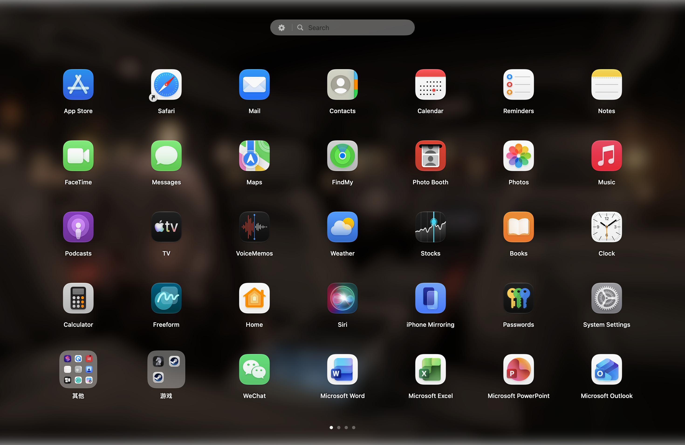

# LaunchDeck

A local, from-scratch replacement for macOS Launchpad — written because macOS 26
removed the real one. Everything here is an original implementation: no code,
icons, assets or strings were taken from any existing app.

**English** · [中文说明](README.zh-CN.md)



## What it does

**Core**
- Full-screen overlay on the display your pointer is on, above all windows
- Your actual desktop wallpaper, with an optional frosted-glass treatment
- 7 × 5 icon grid (adapts down on small displays), horizontal paging with page dots
- Live search: exact / prefix / substring / bundle-id / subsequence ranking
- Click to launch; Return launches the top hit; Esc closes; arrow keys navigate
- Folders: drop an app onto another to create one, rename by double-click,
  remove members, ungroup
- Drag to reorder. Dropping onto an occupied slot **inserts before it** and
  pushes the rest along, so a full page can still be rearranged
- A folder is only made by *resting* on another app for ~1.2 s, never by simply
  releasing over one
- Drag onto a page dot to move an item to that page; resting on a dot flips to
  it after ~0.5 s
- Drag an app out of an expanded folder and drop it on the grid
- The drag gesture lives on the scroll container, not on each cell, so paging
  mid-drag cannot recycle the source cell out from under the gesture. Dragging
  to the left or right screen edge flips pages; edge paging is judged against
  the grid's drawn rect, so it only engages in the chrome bands beside it
- Sort rules: name, date added, last used (Spotlight metadata), or manual
- Fill gaps and reset-to-alphabetical
- Hide/unhide apps, with an optional "show hidden apps in search" mode
- Right-click menu: Open, Quit, Force Quit, Show in Finder, Get Info, Hide, Uninstall

**Import your old layout**
- Reads macOS's own Launchpad database and recreates its pages and folders
- Every app is accounted for: placed, "not installed", or "hidden here"

**Backdrop**
- The window is transparent and an `NSVisualEffectView` with `.behindWindow`
  blending samples the *real* desktop, so the backdrop always matches exactly —
  including a shuffling photo album that `NSWorkspace.desktopImageURL` cannot
  resolve
- Three modes: **Desktop** (dimmed, what Launchpad itself does), **Frosted
  glass** (the same system material the Dock and Notification Centre use), and
  **Custom image** (pin one file, with an adjustable blur)
- This replaced drawing a Gaussian-blurred copy of the wallpaper, which could
  never stay in sync with a rotating desktop and did not look native

**Activation**
- A key recorder: click the field, press the combination you want
- F4 works on its own; other keys need a modifier
- Carbon hot keys, so no Accessibility permission is required
- Optional: the keyboard's Launchpad key (CGEventTap, needs Accessibility),
  pinch-in on the trackpad, and a screen corner (global mouse monitor, no
  permission needed)
- Optional: hide the Dock while the deck is open, as Launchpad does

**Uninstall**
- Scans 12 `~/Library` locations for files matching the bundle id or name
- Shows sizes, lets you deselect, moves everything to the Trash
- Falls back to an authorized (admin) delete for root-owned bundles

**Staying in sync**
- Watches `/Applications`, `~/Applications` and the system application folders
  with FSEvents, so an install or uninstall appears without relaunching
- The rescan runs off the main thread and is debounced, because scanning reads
  Spotlight metadata for every bundle

**Saved state**
- Reopening resumes on the page you left off on, or always returns to page one
  (LaunchOS's "Saved State" vs "Return To Main Page")

**Closing the deck** — any of:
- `Esc`
- click any empty space (including unused grid slots)
- launch an app
- press the shortcut again, or the Launchpad key again
- right-click → **Close**

**Folders**
- Opening zooms the panel out of the icon, using a recorded frame as the
  animation proxy (the approach LaunchOS calls `FolderAnimationProxy*`); the
  source tile hides while the panel is open
- The panel is sized to its contents: 1–4 columns by app count, whole-row
  scrolling past 12 apps
- Double-click the title to rename. The title is a **floating overlay above the
  panel**, not a row inside it, so entering rename mode cannot change the
  folder's size; it becomes a small white field. This mirrors LaunchOS's
  `FolderFloatingTitleView` (label and `titleField` swapped outside the panel's
  layout) — putting the field in the panel's own stack is what widened it

**Getting to the settings**
- A gear button to the **left of the search magnifying glass**
- Right-click anywhere on the deck (empty space) for Settings, Import, Fill Gaps,
  Reset Order, Quit
- ⌘, from the menu bar when the deck is not covering it

The settings window has: import, sort rules, wallpaper and glass, activation
(including the key recorder), hidden apps, permission status, start at login.

## Requirements

- macOS 15 (Sequoia) or later, on Apple silicon
- Xcode **or** the Command Line Tools (`xcode-select --install`)
- No third-party dependencies — there is nothing to install

## Build

```sh
./build.sh            # release
./build.sh debug      # debug
open build/LaunchDeck.app
```

Produces `build/LaunchDeck.app`. No Xcode project, no SwiftPM — `build.sh` calls
`swiftc` directly. To keep it around (and for "start at login" to register):

```sh
cp -R build/LaunchDeck.app /Applications/
```

### Toolchain notes

The code deliberately avoids `@State`, `@Observable` and other macro-backed
SwiftUI property wrappers, so it builds with either Xcode or Command Line Tools
alone. All mutable UI state lives in `ObservableObject` view models and is
consumed through `@ObservedObject` / `@Binding` / `@FocusState`.

SwiftPM is not used: the `libPackageDescription.dylib` in this machine's CLT
install is missing the `Package.init` symbol, so manifests fail to link.

## Where your old Launchpad layout lives

Launchpad was removed in macOS 26, but its database was not. It is *not* in
`~/Library/Application Support/Dock` any more — it moved to the per-user
container directory **next to** `TMPDIR`:

```
/private/var/folders/<xx>/<hash>/0/com.apple.dock.launchpad/db/db
```

Two schema details matter, and getting either wrong silently loses data:

- `items.type` uses **3** for pages and outer folders but **2** for the inner
  group that actually holds a folder's members. Folders are stored as two
  nested groups: the outer carries the name, the inner carries the apps.
- The database is in **WAL mode**. Opening it read-only fails with
  `SQLITE_CANTOPEN` once the Dock has reclaimed the `-shm` sidecar, because
  SQLite would have to create it. LaunchDeck stages a private copy and opens
  *that* read-write.

## Verification

```sh
./build/LaunchDeck.app/Contents/MacOS/LaunchDeck --selftest
```

254 headless checks over everything a screenshot cannot confirm: the capacity
invariant, hide/unhide, folder create/rename/ungroup, moves, all three sort
orders, a full save→reload round trip, wallpaper resolution and glass rendering,
hot key parsing and registration, Launchpad import (against the real database),
paging model clamping, cross-page moves, the frame registry, hot-corner
geometry, grid hit-testing for drags (every slot centre maps back to its own slot, and
trailing empty slots are droppable while points outside the grid are not), timings for the hot paths, and the uninstall scan. It uses a throwaway layout file and never
deletes anything.

`--bench` additionally drives a real scroll and checks that the page indicator
follows it, then exits non-zero if it does not. That is a regression test for
the bug where the dots stayed on page 0 while swiping.

Current status: **254/254 passing**, scroll-follow 3/3, page-switch p95 well inside the
60 fps budget (3.0 ms locally).

The suite earned its keep. Bugs it caught that the UI looked fine through:

1. `DeckStore.init` scanned and reconciled *before* reading the layout file, and
   `reconcile()` ends in `save()`. The saved layout was overwritten with a
   default on every launch, so page order, folders, hidden apps and sort
   settings never survived a restart.
2. `makeFolder` called `removeFromGrid(source)`, which strips an app from any
   folder containing it — instantly undoing the folder it had just created.
3. `enforceCapacity` compacted every page on load, closing gaps the user had
   deliberately left. Now split into `enforceCapacity` (split over-full pages
   only) and `reflow` (compact, only when the grid shape changes).
4. Bundles with an empty `CFBundleDisplayName` produced a nameless icon.
5. `.skipsHiddenFiles` made `contentsOfDirectory` **drop Safari**. Foundation
   resolves symlinks while applying that option, and Safari.app is a symlink
   into the Cryptex volume, so it was silently excluded from the scan. Dot-files
   are now filtered by name instead.
6. `LSUIElement` apps were filtered out of the scan. Launchpad shows them
   (Mission Control, Screenshot, Tips), so the deck both diverged from Launchpad
   and lost apps during import. Filter removed: 143 apps instead of 125.
7. Folder members that failed to resolve were dropped without being reported, so
   imports looked complete when they were not.
8. `NSTemporaryDirectory()` is `…/<hash>/T/`, but the Launchpad database is in
   `…/<hash>/0/` — deriving the path from TMPDIR alone found nothing.
9. **The page dots never moved while swiping.** The scroll offset was tracked
   through a `PreferenceKey` set inside a `.background`, which never fired.
   Replaced with `onScrollGeometryChange`, and covered by a regression test.
10. **`matchedGeometryEffect` broke the folder panel.** Using it to get
    Launchpad's zoom-out-of-the-icon opening rendered a blank box in the
    window's corner and hid the folder's tile, because the source view lives
    inside a lazy container and gets recycled. Replaced with a frame registry
    plus an explicit transform.
11. **A patch script silently discarded its own work.** `sys.exit` fired before
    the file write, so five successful edits were never persisted and the build
    failed on a half-updated file. Patches now always write, and report failures
    instead of aborting.
12. **Snapshot diagnostics were dead code.** `deckVM` was declared but never
    assigned, so the folder-open path never ran and the proxy frame silently
    fell back to a centred panel. Caught by printing the computed start frame
    instead of trusting the picture.
13. **The rename field widened the whole folder.** The title was a row inside
    the panel's stack, so the text field's intrinsic width stretched the panel.
    Moved out into a floating overlay.
14. **Drag to arrange did not work at all.** It was built on SwiftUI's
    `.onDrag`/`.onDrop`, whose failure mode is silent — nothing happened and
    there was no way to tell why. Replaced with a self-managed drag: a
    `DragGesture` reports the pointer, `GridHitTester` (a pure value type, unit
    tested) maps it to a slot, and a proxy icon follows the cursor. Cells also
    carried a `.padding(6)` that made them wider than their grid column, so
    pointer positions could not be mapped back to a slot at all.
15. **The passthrough button drew a solid block.** Tinting a template symbol by
    filling over it with `.sourceAtop` covered the whole rect; the symbol is now
    tinted through its own `paletteColors` configuration.
16. **Cross-page drag was dead code.** The page dots still used `.onDrop`,
    which needs a system drag session — and the system drag had been replaced
    with a self-managed gesture. The dots' drop target could therefore never
    fire. Worse, the gesture was attached per cell, so paging mid-drag recycled
    the source cell in the lazy stack and cancelled the drag; it now lives on
    the scroll container and resolves its source from the drag's start point.
17. **Dropping onto an occupied slot built a folder instead of reordering.**
    On a full page there were no free slots at all, so rearranging was
    impossible — the reported "can't drag it where I want". Drops now insert
    and push; combining is dwell-only.
18. **An unclamped page index crashed on drag.** Dragging into the edge band
    on page 0 set `currentPage = -1`; the guard `page < store.pages.count` does
    not reject negatives, so the next pointer move read `store.pages[-1]` and
    trapped. Clamping now happens at one shared `DragState.clampPage`, and every
    page read checks a lower bound too.
19. **An interior empty page survived forever.** `normalizePages` only removed
    *trailing* empty pages, so a blank page in the middle was re-saved on every
    launch and rendered as a page that dismissed the deck when tapped.
20. **`appendToGrid` ignored capacity**, writing an over-full page that the next
    launch split into an extra page out of nowhere.
21. **The dev tools rewrote the real `layout.json`.** `--bench` and `--snapshot`
    opened the live store and saved it. They now use a read-only store; verified
    by hashing the file across both tools.
22. **Saved bytes were non-deterministic.** Folders were encoded in dictionary
    iteration order, so identical state produced different files.
23. **The snapshot harness could not render animations.** The `NSHostingView`
    was never put in a window, so SwiftUI never advanced `withAnimation` — every
    snapshot showed the folder panel frozen on its first frame, and two
    different states produced byte-identical PNGs. The harness now attaches the
    view to an off-screen window.

## Development aids

```sh
# Render the real view hierarchy to a PNG (no Screen Recording permission needed)
./build/LaunchDeck.app/Contents/MacOS/LaunchDeck --snapshot /tmp/deck.png
./build/LaunchDeck.app/Contents/MacOS/LaunchDeck --snapshot /tmp/settings.png --settings
./build/LaunchDeck.app/Contents/MacOS/LaunchDeck --snapshot /tmp/search.png --query "chr"

# Measure page-switch layout cost (p50 / p95 against the 60 fps budget)
./build/LaunchDeck.app/Contents/MacOS/LaunchDeck --bench 60
```

## Layout

```
Sources/LaunchDeck/
  main.swift                       entry point (+ --selftest, --snapshot)
  AppDelegate.swift                lifecycle, notifications, integration wiring
  SelfTest.swift                   the check suite
  Snapshot.swift                   offscreen renderer
  Models/
    AppInfo.swift                  AppInfo, SortKey, AppFolder, DeckSlot
    GridMetrics.swift              screen → columns/rows/icon size
  Services/
    AppScanner.swift               discovers apps in the standard locations
    DeckStore.swift                layout model, persistence, import, reconciliation
    LaunchpadImporter.swift        reads macOS's Launchpad SQLite database
    RuntimeCache.swift             icon cache + cached running-app set
    WallpaperProvider.swift        wallpaper resolution, downscaling, glass
    DeckSettings.swift             UserDefaults-backed preferences
    HotKeyManager.swift            HotKeySpec + Carbon registration
    LaunchpadKeyMonitor.swift      CGEventTap for the Launchpad key
    PinchMonitor.swift             global magnification monitor
    HotCornersMonitor.swift        pointer-into-corner trigger
    AppUninstaller.swift           related-file scan + Trash
    LaunchServices.swift           launch / quit / reveal / Get Info
    Permissions.swift              Accessibility / Full Disk Access checks
  UI/
    LaunchpadView.swift            the deck, backdrop, scroller, search bar
    LaunchpadViewModel.swift       search, selection, folders
    PagingState.swift              PageIndicator / PageJumper (isolated paging)
    Backdrop.swift                 system-material backdrop + modes
    FrameRegistry.swift            tile frames, for the folder animation proxy
    GridHitTester.swift            pure point → slot mapping, unit tested
    DragState.swift                in-progress drag: target, proxy, page flips
    PassthroughButton.swift        first-click button that never takes focus
    LaunchpadWindowController.swift
    AppCell.swift                  app + folder cells, empty slot
    FolderOverlayView.swift        expanded folder
    SettingsView.swift             settings window (+ hot key recorder)
    AuxiliaryWindows.swift         settings / uninstall window hosting
    UninstallView.swift            uninstall confirmation UI
Tools/make-icon.swift              generates Resources/AppIcon.icns
```

State lives in `~/Library/Application Support/LaunchDeck/layout.json`:
pages, folders, hidden apps, sort settings and manual order.

## Performance

Two separate problems, both measured.

**Per-frame work in the body** (`--selftest`, 144 apps):

| Hot path | Cost |
|---|---|
| Running-state lookup, 143 apps × 20 | 0.2 ms |
| Icon lookup, 143 apps × 5 | 0.1 ms |
| Glass wallpaper, cold | 59 ms |
| Glass wallpaper, cached | 0.8 ms |

Every cell used to ask `NSWorkspace` whether its app was running and re-fetch
its icon on every render, and the wallpaper was composited at full source
resolution (up to 4000 px). Both are now cached set/dictionary hits, and the
wallpaper is decoded once at screen resolution.

**Page-switch stutter** (`--bench`). State was piled into one `ObservableObject`
that the whole deck observed, so *every mouse move over an icon* and *every
frame of a page swipe* rebuilt all 175 cells:

| | before | after |
|---|---|---|
| Page switch, mean | 52.2 ms | — |
| Page switch, p50 | — | **3.8 ms** |
| Page switch, p95 | — | **4.7 ms** |
| Worst observed | 97.4 ms | 9.6 ms |

Re-measured at 60 iterations, 4 pages, 146 apps: p50 2.1 ms, p95 3.0 ms, worst
11.0 ms. Absolute timings drift with machine and run — the p95 against the 16.7 ms
budget is the figure that matters.

The 60 fps budget is 16.7 ms, so p95 is now comfortably inside it. Three changes:

1. **Hover is per-cell.** Each cell owns a `HoverState` (`@StateObject`), so
   hovering repaints one icon instead of the entire deck.
2. **Paging is not in the grid's observation graph.** `PageIndicator` (the
   settled page, read only by the dots) and `PageJumper` (a requested jump,
   observed only by the scroller) are separate objects; the scroller holds the
   indicator as a plain reference so writing it cannot rebuild the grid.
3. **No two-way scroll binding.** The page is derived with
   `onScrollGeometryChange`, which fires only when the derived page number
   changes. A `scrollPosition` binding published twice per frame and fed a
   second publish through `onChange`.

Per-icon `.shadow` and `.interpolation(.high)` were also removed; both forced an
offscreen pass per cell.

## Known gaps

- Pinch triggers on **any** finger count. AppKit exposes pinch magnification but
  not how many fingers produced it; real Launchpad reads a private multitouch
  framework to distinguish three/four/five fingers.
- A shuffling desktop records no "current" image, so the deck picks one photo per
  rotation slot rather than mirroring the exact one on screen. Matching exactly
  would need the Screen Recording permission.
- The folder zoom is a transform of the panel, not a separate proxy layer, so
  it does not morph the tile's own artwork the way Launchpad's does.
- Hot corners use a global mouse monitor, so the pointer has to actually move
  into the corner; Launchpad's own implementation behaves the same way.
- A drop on a page dot moves the item to the **end** of that page. There is no
  grid position under the pointer to insert at, and this matches Launchpad.
  Cross-page positioning is done by edge-dragging, which reflows live.
- No backup import/export, no multi-language strings, no auto-update. Auto-update
  and licence activation are the only parts of the original that are genuinely
  unnecessary for personal use.
- The expanded-folder presentation is a centred frosted panel rather than a
  zoom-out-of-the-icon animation.

## Contributing

See [CONTRIBUTING.md](CONTRIBUTING.md) for the build/test workflow and the code
conventions — most importantly, that every new check has to be mutation-tested so it
can actually fail. Bug reports get much easier to act on if you attach
`~/Library/Application Support/LaunchDeck/layout.json`; it is the entire persisted
state.

The development history behind the fixes listed above lives in local review notes and
is not published with the repo.

## License

MIT — see [LICENSE](LICENSE).
